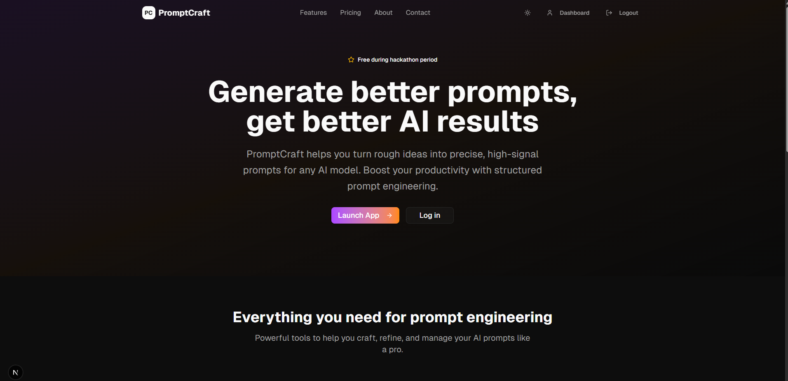
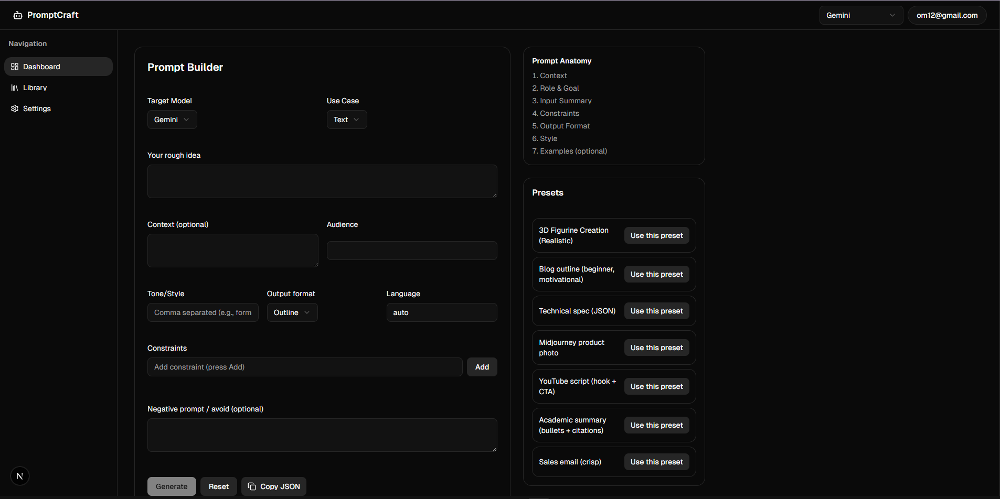
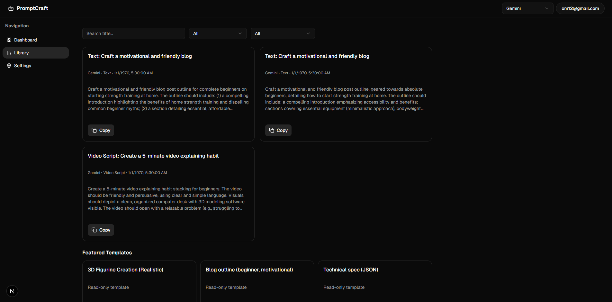
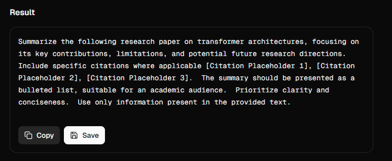
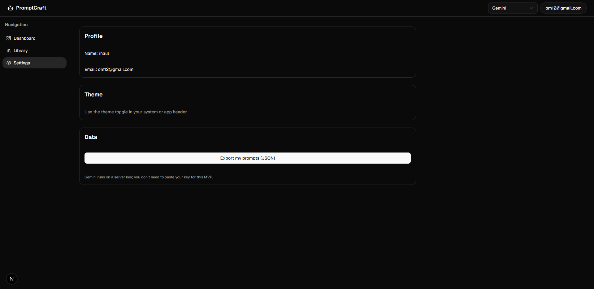

# 🚀 PromptCraft – AI-Powered Prompt Engineering Assistant

PromptCraft is a web app built for the **Appwrite Hackathon** that helps you generate professional AI prompts effortlessly. It transforms rough, simple ideas into precise, structured prompts compatible with any AI model (like Google Gemini, GPT, etc.).

## 🔗 Links
 - Deployed Site: [To be filled with your Appwrite deployment link]

## 🛠️ Tech Stack

- **Frontend:** Next.js, TailwindCSS, shadcn/ui  
- **Backend & Authentication:** Appwrite  
- **AI Integration:** Google Gemini AI  
- **Routing:** Next.js App Router  
- **Deployment:** Appwrite Hosting  

### 🎥 Demo Video


https://github.com/user-attachments/assets/b9cfa9fe-d11b-44aa-a8cb-7db330b25da5


### 📸 Screenshots

### 🔹 Landing Page  
  

### 🔹 Prompt Builder  
 

### 🔹 Prompt Library  
  

### 🔹 Result  
  

### 🔹 Settings  
  

## ✨ Features  

- 🎯 **Transform rough ideas into precise AI prompts**  
    Most people struggle to explain their ideas in a way that AI can understand.  
    With **PromptCraft**, you just type your *raw thought* and let the system          structure it into a professional prompt.  
    This saves time, removes frustration, and ensures you get the **best possible AI output**.  


- 🧠 **AI-powered with Google Gemini API**  
    **Gemini** brings advanced reasoning and contextual understanding.  
    By integrating it, PromptCraft ensures your prompts are not only well-written but also  **optimized for clarity, tone, and impact**.  
    That means less trial-and-error and more **productive results on the first try**.  


- ⚡ **Built with Next.js App Router for speed & performance**  
    No one likes slow tools.  
    PromptCraft is designed to be **snappy and efficient**, so you can brainstorm,      refine, and test prompts instantly without waiting.  
    This makes it perfect for **hackathons, work projects, or daily creative tasks**.  

- 🎨 **Styled with TailwindCSS & shadcn/ui**  
    Good design matters.  
    The **clean and minimal UI** makes the tool easy to use even for **non-technical users**.  
    Instead of being overwhelmed by complexity, users enjoy a **smooth, intuitive experience**.  


- 🔐 **Authentication & backend powered by Appwrite**  
    Secure login, user data handling, and project management are all handled seamlessly with **Appwrite**.  
    You can save your prompts, manage them safely, and access them from anywhere — **no messy setups required**.  


- 📚 **Prompt Presets (YouTube scripts, blogs, sales emails, JSON specs & more)**  
    Sometimes you don’t even know where to start.  
    PromptCraft offers ready-made **prompt templates** for common use cases like YouTube videos, blog writing, technical specs, and emails.  
    This makes it **super easy for beginners**, while still giving **power users flexibility** to customize.  

## 🤝 Inspiration

#### AI is powerful, but crafting the right prompts can be challenging. Many users struggle to convert raw ideas into clear instructions that AI models understand. PromptCraft bridges this gap by making prompt engineering easy, fast, and accessible for developers, creators, and businesses alike.


## 🚀 Getting Started

### 1️⃣ Clone the repository

```bash
git clone https://github.com/your-username/promptcraft.git
cd promptcraft
```
### 2️⃣ Install dependencies
```
pnpm install
```
### 3️⃣ Setup environment variables
- Create a .env.local file in the root directory and add your keys:
```
NEXT_PUBLIC_APPWRITE_ENDPOINT=your-appwrite-endpoint
NEXT_PUBLIC_APPWRITE_PROJECT=your-appwrite-project-id
GEMINI_API_KEY=your-gemini-api-key
```
### 4️⃣ Run the app locally
```
pnpm run dev
```

## 🔮 Future Plans
- Add multi-model support (GPT, Claude, LLaMA)
- Provide prompt optimization suggestions
- Export prompts in multiple formats (Markdown, JSON, etc.)
- Enable team collaboration features

## 📜 License
- This project is licensed under the [MIT License](./LICENSE).


- **Made with ❤️ for the Appwrite Hackathon 2025**


``` 
If you want, I can also help you generate a polished project logo or banner for your GitHub repo to enhance its visual appeal. Just let me know!
```
